

  <h2> NodeJs Notes </h2>
  

    

## NodeJs
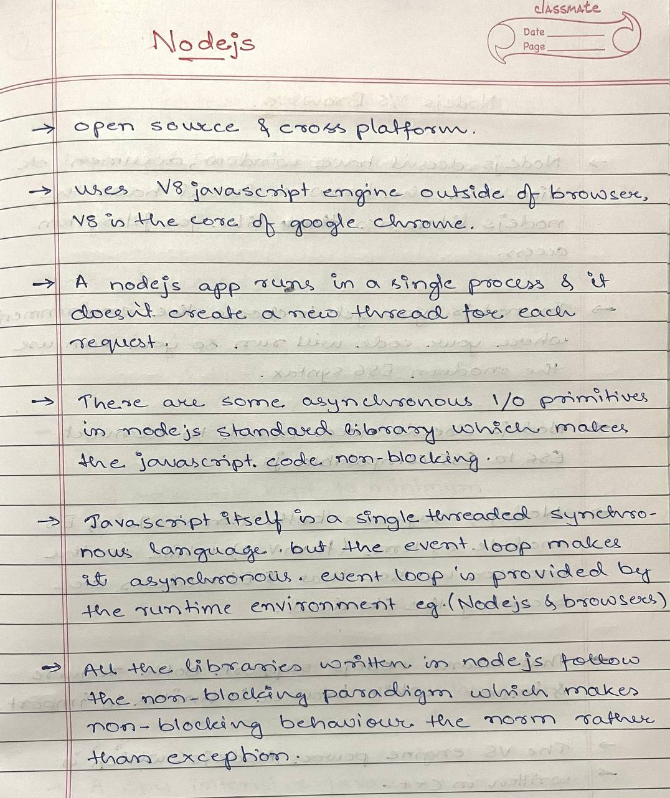

  

## NodeJs vs Browser
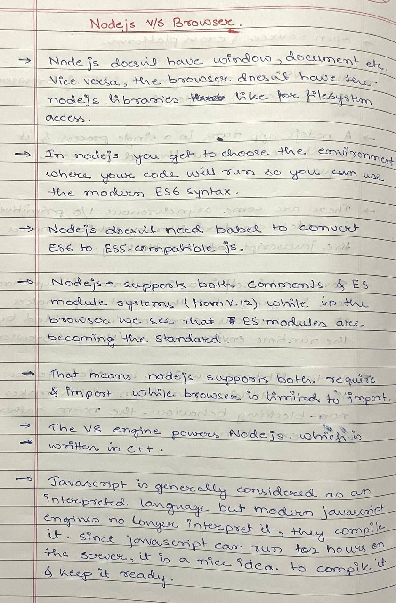

  

## Production vs Development

  

## Blocking vs Non-Blocking
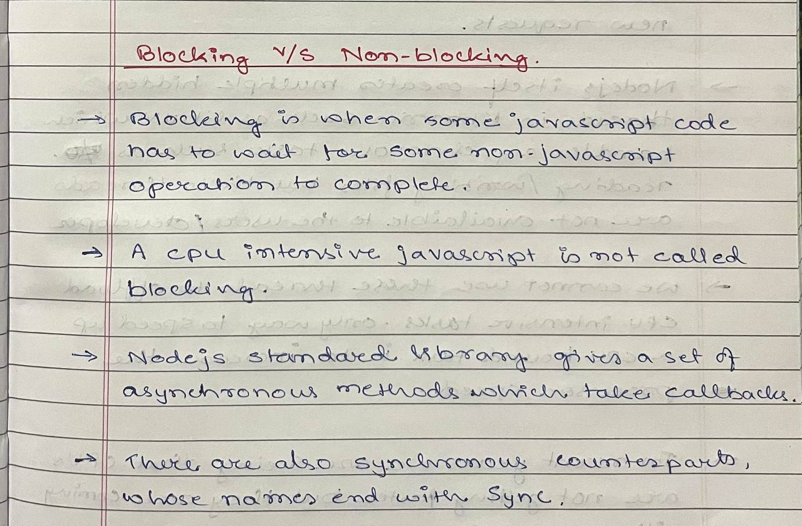

  

## Concurrency & Throughput
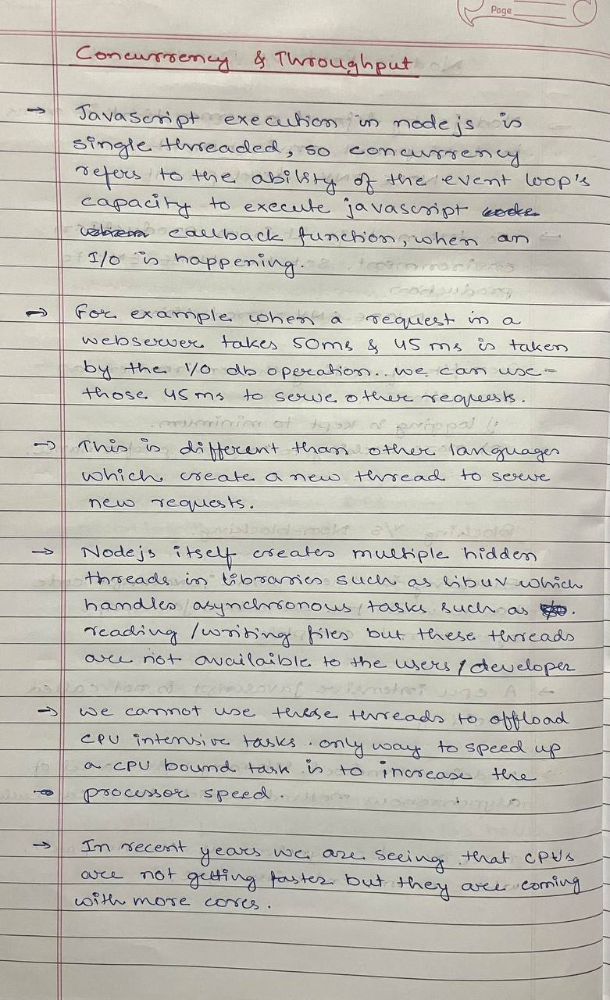
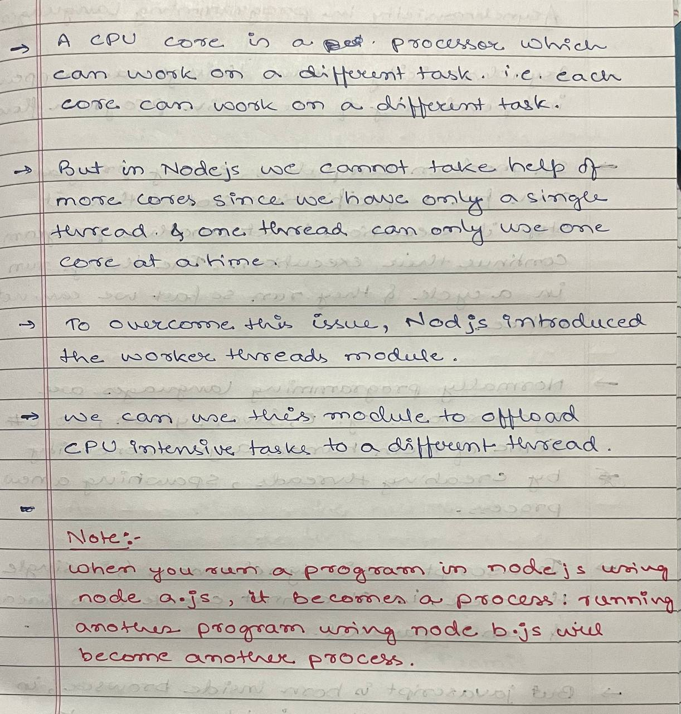

  

## Asynchronicity

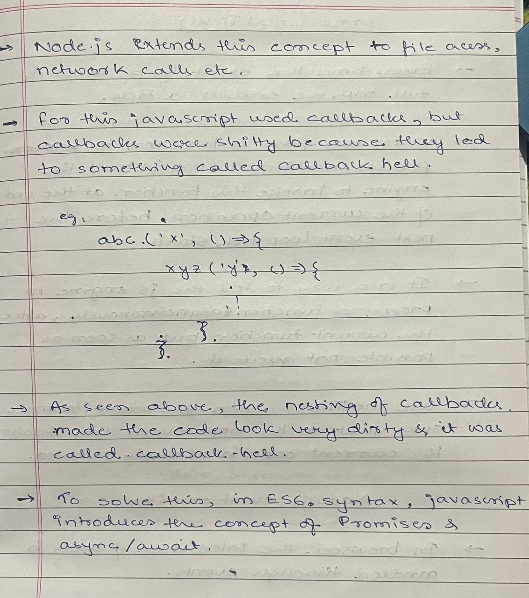

  

## process.nextTick()
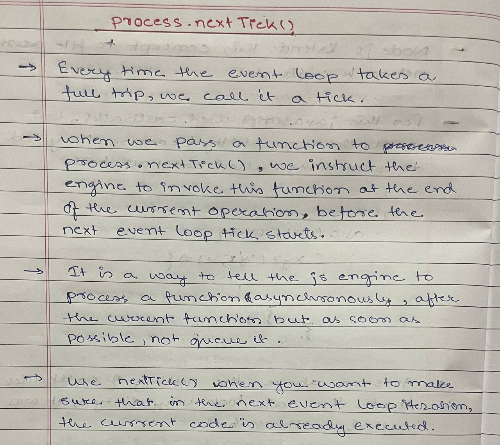

  

## Event Emitter
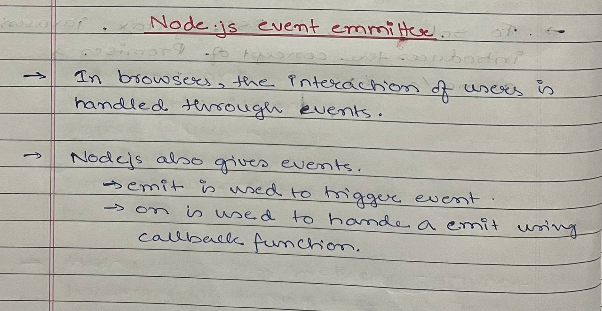
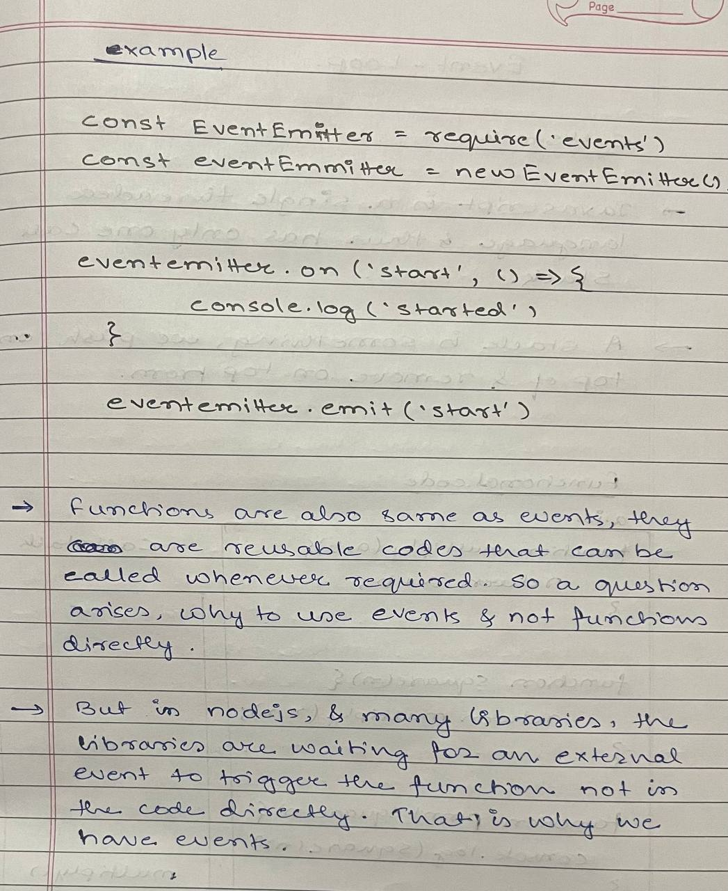

  

## Event Loop
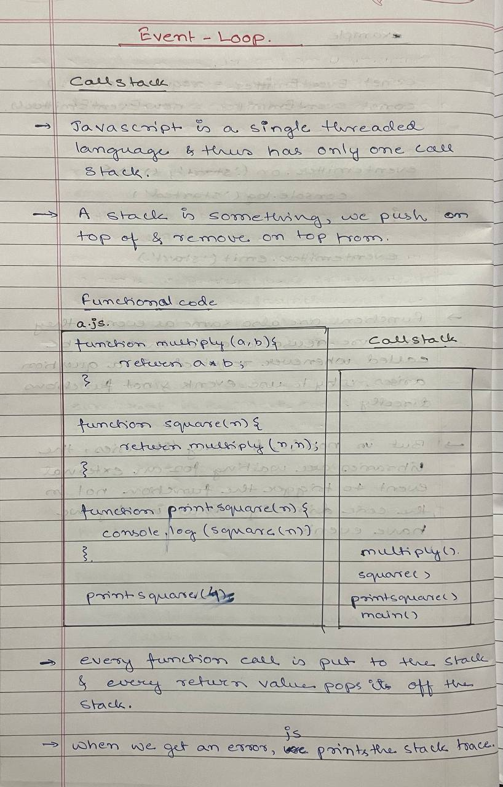
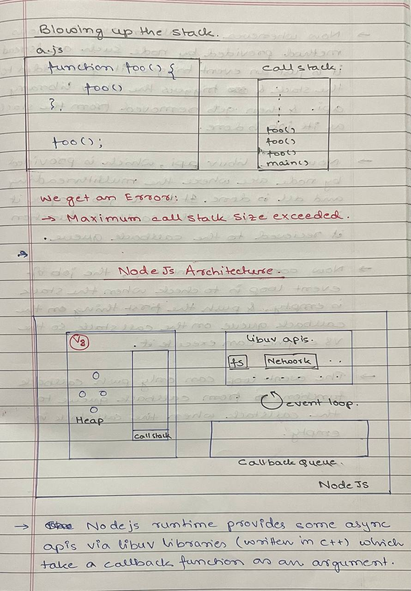

  